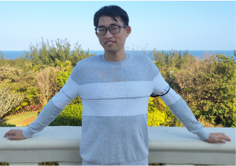
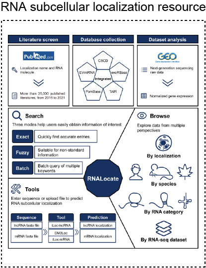

# Curriculum Vitae of Puwen Tan

## Puwen Tan

Ph.D. in bioinformatics, Southern Medical University, Guangzhou, Guangdong, China, 510515

Email: bioinfo_wen@163.com

Tel: (+86) 182 4606 0545

### 1. Summary:

**Puwen Tan** is a highly-motivated bioinformatician with strong interests in developing methods to uncover the cell identity and characterize the cell state transition from multiple perspectives. He is proficient in a variety of skills including **single-cell RNA-seq analysis**, **data visualization**, and **R package development**. For the past 5 years, he mainly focused on exploring the cellular heterogeneity of hematopoietic stem cells (2017 *Nat Commun*, 2018 *Autophagy*, 2021 *Cell Stem Cell*, and 2022 *Sci Adv*) using bioinformatic methods. Most recently, he is looking for a postdoctoral position in computational biology which focuses on developing single-cell multi-omics analysis methods.

### 2. Education:

2019 - 2022, Ph.D. in bioinformatics, Southern Medical University, China

2016 - 2019, Master of Biomedical Engineering (bioinformatics), Harbin Medical University, China

2011 - 2016, Bachelor of Biotechnology (biomedical software engineering), Harbin Medical University, China

### 3. Skills:

1. Strong programming skills in using R language for statistical analysis, visualization and software development.
2. Proficient in high-throughput sequencing data (including: bulk & single-cell RNA-seq, ChIP-seq, CLIP-seq, and single-cell Nanopore-seq) analysis .
3. Extensive collaboration experiences with biologists.
4. Fluent with English writing and speaking.

### 4. Academic experience:

Here list the main studies for the last 5 years:

#### I. A computational framework for transcription factor activity analysis (submitted to ***Nat Commun***).

This research developed an integrated computational framework for gene regulatory network inference and transcription factor activity estimation from single-cell RNA sequencing data. In bref, we utilized an entropy-based algorithm to infer the weighted regulatory relationship between regulators and targets by decomposing the unique information from multivariate information. This framework Embed several functions such as transcriptional factor activity quantification, dimensionality reduction, cell-type-specific regulon analysis, pathway enrichment analysis, and visualization. This work aims to establish a comprehensive single-cell analysis framework for transcription factors just like other commonly used single-cell pipelines such as Seurat.

\* First author, mainly responsible for **study design**, **software development**, **bioinformatics analysis**, **visualization** and **manuscript writing**. Softwares from this project were deposited in GitHub: [https://github.com/hmutpw/scATFR](https://github.com/hmutpw/scATFR) and [https://github.com/hmutpw/PUIC](https://github.com/hmutpw/PUIC/).

#### II. Constructing the RNA subcellular localization landscape of embryonic stem cells (Manuscript in preparation).

This research comprehensively characterized the subcellular localization pattern of RNA moleculars in embryonic stem cells. We identified several gene showed distinc localization pattern among five different subcellular locations. Meanwhile, we explored the subcellular localization pattern of alternative splicing events between cytoplasm and nucleus, and predicted several RNA binding proteins that potentional regulate the nuclear export.

\* Co-first author, mainly responsible for **bioinformatics analysis**, **visualization**, and **manuscript writing**.

#### III. Single-cell sequencing reveals the critical role of alternative splicing in the hematopoietic stem cell formation (2022 ***Sci Adv***)

This research constructed an isoform-based transcriptional atlas of the murine endothelial-to-hematopoietic stem cell using single-cell full-length RNA sequencing data. In brief, we comprehensively described the isoform diversity and alternative splicing landscape during hematopoietic stem cell formation. Then, we also identified hundreds of stage-specific isoforms that potentially affect the hematopoietic stem cell formation and validated their expression using single-cell Nanopore sequencing of full-length transcripts. Subsequently, in vitro knockdown experiments showed that knockdown of some hemogenic-specific isoforms indeed affects the generation of  HSCs. Next, motif enrichment combined with knockout experiments confirmed that the RNA-binding protein (RBP), Srsf2, could affect the specialization of endothelial cells into hematopoietic stem cells by regulating the AS of key transcription factors such as Runx1 and Myb. 

\* Co-first author, mainly responsible for **study design**, **bioinformatics analysis**, **visualization**, and **manuscript writing**. The code was deposited in GitHub:[https://github.com/hmutpw/scAS/](https://github.com/hmutpw/scAS/).

#### IV. *hnRNPLL* controls pluripotency exit of embryonic stem cells by modulating alternative splicing of *Tbx3* and *Bptf* (2021 ***EMBO J***)

This research revealed that RNA binding protein *hnRNPLL* regulates the embryonic stem cell exit from pluripotency by modulating the alternative splicing of some key transcription factors that maintain the pluripotency.

\* Co-first author, mainly responsible for **bioinformatics analysis**, and **visualization**.

#### V. Depicting the dynamic activity of autophagy at transcriptome level during the human stem cell differentiation (2018 & 2019, ***Autophagy***)

This research investigated the dynamic patterns of autophagy-related genes during human fetal digestive tract development using single-cell RNA sequencing data. Meanwhile, we also identified several autophagy-related genes that potentially regulate monocytic-granulocytic differentiation.

\* First author, mainly responsible for **bioinformatics analysis**, **visualization**, and **manuscript writing**.

#### VI. Construction of the RNA subcellular localization resources. (2017 & 2021, ***Nucleic Acids Res***)

These studies constructed and updated the RNA subcellular localization database for transcriptome level.

\* Co-first author, mainly responsible for **data collecting** and **visualization**.

### 5. Research Interests:

Single-cell multi-omics

Machine learning

Software development

Hematopoietic stem cell

### 6. Full list of Publications:

( †: equally contribution; \*: corresponding author )

#### 2022
1. Fang Wang†, **Puwen Tan†**, Pengcheng Zhang†, Yue Ren†, Jie Zhou, Yunqiao Li, Siyuan Hou, Shuaili Li, Linlin Zhang, Yanni Ma, Chaojie Wang, Wanbo Tang, Xiaoshuang Wang, Yue Huo, Yongfei Hu, Tianyu Cui, Chao Niu, Dong Wang\*, Bing Liu\*, Yu Lan\*, Jia Yu\*. Single-cell architecture and functional requirement of alternative splicing during hematopoietic stem cell formation. ***Sci Adv***. 2022 Jan 7;8(1):eabg5369. [Full-text](https://www.science.org/doi/10.1126/sciadv.abg5369)

#### 2021
2. Juanjuan Kang, Qiang Tang, Jun He, Le Li, Nianling Yang, Shuiyan Yu, Mengyao Wang, Yuchen Zhang, Jiahao Lin, Tianyu Cui, Yongfei Hu, **Puwen Tan**, Jun Cheng, Hailong Zheng, Dong Wang\*, Xi Su\*, Wei Chen\*, Yan Huang\*. RNAInter v4.0: RNA interactome repository with redefined confidence scoring system and improved accessibility. ***Nucleic Acids Res***. 2021 Oct 30;gkab997. [Full-text](https://doi.org/10.1093/nar/gkab997)
3. Tianyu Cui†, Yiying Dou†, **Puwen Tan†**, Zhen Ni, Tianyuan Liu, DuoLin Wang, Yan Huang, Kaican Cai, Xiaoyang Zhao, Dong Xu\*, Hao Lin\*, Dong Wang\*. RNALocate v2.0: an updated resource for RNA subcellular localization with increased coverage and annotation. ***Nucleic Acids Res***. 2021 Sep 22;gkab825. [Full-text](https://doi.org/10.1093/nar/gkab825)
4. Yang Zhang\*, Tianyuan Liu, Xuesong Hu, Mei Wang, Jing Wang, Bohao Zou, **Puwen Tan**, Tianyu Cui, Yiying Dou, Lin Ning, Yan Huang, Shuan Rao, Dong Wang\*, Xiaoyang Zhao\*. CellCall: integrating paired ligand-receptor and transcription factor activities for cell-cell communication. ***Nucleic Acids Res***. 2021 Sep 7;49(15):8520-8534. [Full-text](https://doi.org/10.1093/nar/gkab638)
5. Jingyuan Tong, Ting Sun, Shihui Ma, Yanhong Zhao, Mankai Ju, Yuchen Gao, Ping Zhu, **Puwen Tan**, Rongfeng Fu, Anqi Zhang, Ding Wang, Di Wang, Zhijian Xiao, Jiaxi Zhou, Renchi Yang, Stephen J Loughran, Juan Li, Anthony R Green, Emery H Bresnick, Dong Wang\*, Tao Cheng\*, Lei Zhang\*, Lihong Shi\*. Hematopoietic stem cell heterogeneity is linked to the initiation and therapeutic response of myeloproliferative neoplasms. ***Cell Stem Cell***. 2021 Mar 4;28(3):502-513.e6. [Full-text](https://doi.org/10.1016/j.stem.2021.01.018)
6. Xue Wang†, Changyun Ping†, **Puwen Tan†**, Chenguang Sun, Guang Liu, Tao Liu, Shuchun Yang, Yanmin Si, Lijun Zhao, Yongfei Hu, Yuyan Jia, Xiaoshuang Wang, Meili Zhang, Fang Wang, Dong Wang\*, Jia Yu\*, Yanni Ma\*, Yue Huang\*. *hnRNPLL* controls pluripotency exit of embryonic stem cells by modulating alternative splicing of *Tbx3* and *Bptf*. ***EMBO J***. 2021 Feb 15;40(4):e104729. [Full-text](https://doi.org/10.15252/embj.2020104729)

#### 2020
7. Yunqing Lin, Tianyuan Liu, Tianyu Cui, Zhao Wang, Yuncong Zhang, **Puwen Tan**, Yan Huang, Jia Yu, Dong Wang\*. RNAInter in 2020: RNA interactome repository with increased coverage and annotation. ***Nucleic Acids Res***. 2020 Jan 8;48(D1):D189-D197. [Full-text](https://doi.org/10.1093/nar/gkz804)

#### 2019
8. **Puwen Tan†**, Yue Ren†, Yuncong Zhang†, Yunqing Lin, Tianyu Cui, Yan Huang, Yang Zhang, Lin Ning, Jia Yu, Shuai Gao, Dong Wang, He Huang\*. Dissecting dynamic expression of autophagy-related genes during human fetal digestive tract development via single-cell RNA sequencing. ***Autophagy***. 2019 Nov;15(11):2019-2021. [Full-text](https://doi.org/10.1080/15548627.2019.1656956)

#### 2018
9. Yan Huang†, **Puwen Tan†**, Xiaoshuang Wang, Ying Yi, Yongfei Hu\*, Dong Wang\*, Fang Wang\*. Transcriptomic insights into temporal expression pattern of autophagy genes during monocytic and granulocytic differentiation. ***Autophagy***. 2018;14(3):558-559. [Full-text](https://doi.org/10.1080/15548627.2018.1425060)
10. Tianyu Cui, Lin Zhang, Yan Huang, Ying Yi, **Puwen Tan**, Yue Zhao, Yongfei Hu, Liyan Xu, Enmin Li, Dong Wang. MNDR v2. 0: an updated resource of ncRNA–disease associations in mammals. ***Nucleic Acids Res***. 2018 Jan 4;46(D1):D371-D374. [Full-text](https://doi.org/10.1093/nar/gkx1025)

#### 2017
11. Hongmei Zhao, Xiaoshuang Wang, Ping Yi, Yanmin Si, **Puwen Tan**, Jinrong He, Shan Yu, Yue Ren, Yanni Ma, Junwu Zhang, Dong Wang\*, Fang Wang\*, Jia Yu\*. KSRP specifies monocytic and granulocytic differentiation through regulating miR-129 biogenesis and *RUNX1* expression. ***Nat Commun***. 2017 Nov 10;8(1):1428. [Full-text](https://www.nature.com/articles/s41467-017-01425-3)
12. Ying Yi, Yue Zhao, Chunhua Li, Lin Zhang, Huiying Huang, Yana Li, Lanlan Liu, Ping Hou, Tianyu Cui, **Puwen Tan**, Yongfei Hu, Ting Zhang, Yan Huang, Xiaobo Li\*, Jia Yu\*, Dong Wang\*. RAID v2.0: an updated resource of RNA-associated interactions across organisms. ***Nucleic Acids Res***. 2017 Jan 4;45(D1):D115-D118. [Full-text](https://doi.org/10.1093/nar/gkw1052)
13. Ting Zhang†, **Puwen Tan†**, Liqiang Wang†, Nana Jin†, Yana Li, Lin Zhang, Huan Yang, Zhenyu Hu, Lining Zhang, Chunyu Hu, Chunhua Li, Kun Qian, Changjian Zhang, Yan Huang, Kongning Li\*, Hao Lin\*, Dong Wang\*. RNALocate: a resource for RNA subcellular localizations. ***Nucleic Acids Res***. 2017 Jan 4;45(D1):D135-D138. [Full-text](https://doi.org/10.1093/nar/gkw728)

#### Before 2016
14. Deng Wu, Yan Huang, Juanjuan Kang, Kongning Li, Xiaoman Bi, Ting Zhang, Nana Jin, Yongfei Hu, **Puwen Tan**, Lu Zhang, Ying Yi, Wenjun Shen, Jian Huang, Xiaobo Li, Xia Li, Jianzhen Xu, Dong Wang. ncRDeathDB: A comprehensive bioinformatics resource for deciphering network organization of the ncRNA-mediated cell death system. ***Autophagy***. 2015;11(10):1917-26. [Full-text](https://doi.org/10.1080/15548627.2015.1089375)
15. Liqiang Wang, Kun Qian, Yan Huang, Nana Jin, Hongyan Lai, Ting Zhang, Chunhua Li, Chunrui Zhang, Xiaoman Bi, Deng Wu, Changliang Wang, Hao Wu, **Puwen Tan**, Jianping Lu, Liqun Chen, Kongning Li, Xia Li, Dong Wang. SynBioLGDB: a resource for experimentally validated logic gates in synthetic biology. ***Sci Rep***. 2015 Jan 28;5:8090. [Full-text](https://www.nature.com/articles/srep08090)
16. Xiaomeng Zhang, Deng Wu, Liqun Chen, Xiang Li, Jinxurong Yang, Dandan Fan, Tingting Dong, Mingyue Liu, **Puwen Tan**, Jintian Xu, Ying Yi, Yuting Wang, Hua Zou, Yongfei Hu, Kaili Fan, Juanjuan Kang, Yan Huang, Zhengqiang Miao, Miaoman Bi, Nana Jin, Kongning Li, Xia Li, Jianzhen Xu, Dong Wang. RAID: a comprehensive resource for human RNA-associated (RNA–RNA/RNA–protein) interaction. ***RNA***. 2014 Jul;20(7):989-93. [Full-text](https://rnajournal.cshlp.org/content/20/7/989)

### 7. Other meterials:
GitHub: [https://github.com/hmutpw](https://github.com/hmutpw)

ResearchGate: [https://www.researchgate.net/profile/Puwen-Tan](https://www.researchgate.net/profile/Puwen-Tan)

Google Scholar: [Puwen Tan](https://scholar.google.co.uk/citations?hl=en&pli=1&user=WnzYYR4AAAAJ)

Academic transcripts: [English version](./transcript_English.jpg)    [中文成绩单](./transcript_Chinese.jpg)

